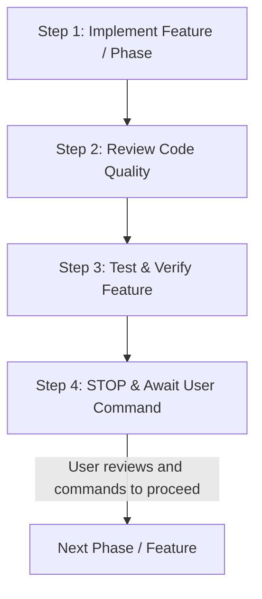

# Phased Delivery Workflow: Implement -> Review -> Test -> Stop

This skill defines the mandatory 4-step execution lifecycle that the agent and developers must follow for **every single phase or major feature** in the project.

---

## The 4-Step Lifecycle



---

## Step 1: Implement Feature / Phase
- Strictly implement only the scope of the active phase (do not jump ahead to subsequent phases).
- Adhere strictly to the workspace guidelines in `AGENTS.md` and domain constraints in `ecommerce-business-rules`.
- Ensure all file changes and new modules are properly linked and exported.

---

## Step 2: Review Code Quality
Immediately after implementation and before running feature tests, run comprehensive code quality checks:

1. **TypeScript Strict Type Check**:
   ```bash
   # Backend
   cd apps/backend && npx tsc --noEmit

   # Frontend
   cd apps/frontend && npx tsc --noEmit
   ```
   - Verify zero `any` types.
   - Verify strict null checks pass.
2. **Linting & Formatting Check**:
   ```bash
   npm run lint
   ```
3. **Prisma Schema Validation** (if backend/database changes occurred):
   ```bash
   cd apps/backend && npx prisma validate
   ```
4. Fix any lint, typing, or syntax issues immediately before proceeding.

---

## Step 3: Test Feature
Execute automated and functional verification for the implemented feature:

1. **Automated Unit & Integration Tests**:
   ```bash
   npm test
   ```
   - Ensure all new and existing tests pass.
2. **Feature-Specific Verification**:
   - Verify specific endpoints or UI components implemented in this phase.
   - For database/auth: verify token generation, hashing, or record insertion.
   - For business rules: verify Dhaka (৳60) vs Outside Dhaka (৳120), BDT currency formatting, and strict category variation constraints.
3. **Production Build Verification**:
   ```bash
   npm run build
   ```
   - Ensure both frontend and backend build with exit code `0`.

---

## Step 4: STOP and Await User Command (MANDATORY)

> [!CAUTION]
> **DO NOT PROCEED TO THE NEXT PHASE AUTOMATICALLY.**
> After finishing Step 3, you MUST stop calling tools and present your report to the user.

### Required Completion Report:
1. **Summary of Accomplishments**: What was implemented in this phase.
2. **Code Quality Review Results**: Results of `tsc --noEmit`, linting, and standards compliance.
3. **Test Results & Verification Details**: Automated test outputs and functional check results.
4. **Halt & Await Approval**: Explicitly notify the user:
   > *"Phase [X] is complete, reviewed, and verified. I have paused here. Please review and command me when you are ready to proceed to Phase [X+1]."*
